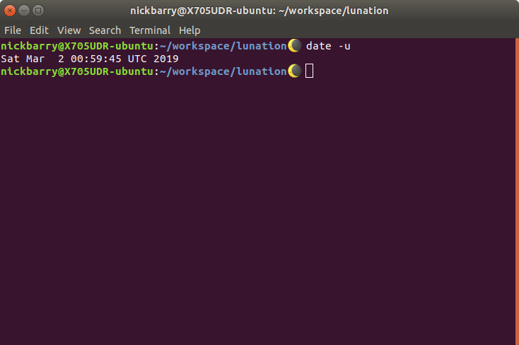

# Lunation

Keep your terminal in sync with the phases of the moon via a dynamic prompt.

Moon phase calculations in Bash thanks to [nikospag](https://github.com/nikospag/bash-moon-phase).

## Super Blood Wolf Moon Eclipse?

Not supported.

## Install

Run `install.sh` or add the contents of `set_moon_phase.sh` to your `.bashrc` file manually.

## Uninstall

Remove the lines from your `.bashrc` file which match the contents of `set_moon_phase.sh`.

